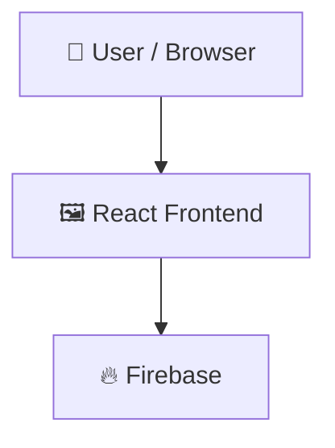

<<<<<<< HEAD
# Online-Exam-Management-System

> Role-based online exam management system for students, teachers, and administrators

## 📑 Table of Contents

- [Description](#description)
- [Key Features](#key-features)
- [Use Cases](#use-cases)
- [Screenshots](#screenshots)
- [Tech Stack](#tech-stack)
- [Architecture](#architecture)
- [Quick Start](#quick-start)
- [Key Dependencies](#key-dependencies)
- [Available Scripts](#available-scripts)
- [Project Structure](#project-structure)
- [Development Setup](#development-setup)
- [Contributors](#contributors)
- [Contributing](#contributing)

## 📝 Description

Online Exam Management System (ExamSphere) is a web application designed to organize, conduct, and evaluate academic assessments. It addresses the workflow challenges of educational institutions by providing centralized tools for creating tests, managing classrooms, delivering timed tests, and reviewing student submissions.

## ✨ Key Features

- **🛡️ Role-Based Access Control** — Provides dedicated workflows, dashboards, and permissions for students, teachers, and administrators.
- **⏱️ Timed Examination Interface** — Enables students to view upcoming tests, read instructions, navigate questions, and complete timed online exams.
- **🗂️ Exam and Question Authoring** — Allows teachers to create tests, manage reusable question banks, publish assessments, and manually evaluate short answers.
- **🏫 Class and Enrollment Management** — Supports classroom creation, student enrollment tracking, and user management across the organization.
- **📊 Performance Analytics and Logs** — Tracks student results, displays historical score trends, and gives administrators system-wide activity monitoring logs.
- **🌗 Theme and Profile Customization** — Offers light and dark theme toggles along with customizable user profile information.

## 🎯 Use Cases

- Delivering and grading online coursework exams in schools and universities
- Managing test questions and automated assessments across multiple academic classes
- Tracking student examination progress and viewing historical performance trends

## 🛠️ Tech Stack

    

## 🏗️ Architecture

A high-level view of how the main pieces fit together:



## ⚡ Quick Start

```bash

# 1. Clone the repository
git clone https://github.com/Sukalpa-Chakraborty/Online-Exam-Management-System.git

# 2. Install dependencies
npm install

# 3. Start the dev server
npm run dev
```

## 📦 Key Dependencies

```
@tailwindcss/vite: ^4.3.3
firebase: ^12.18.0
lucide-react: ^1.33.0
react: ^19.2.8
react-dom: ^19.2.8
react-router-dom: ^7.18.2
recharts: ^3.10.1
tailwindcss: ^4.3.3
```

## 🚀 Available Scripts

- **dev** — `npm run dev`
- **build** — `npm run build`
- **lint** — `npm run lint`
- **preview** — `npm run preview`

## 📁 Project Structure

```
.
├── eslint.config.js
├── index.html
├── package.json
├── public
│   ├── favicon.png
│   ├── favicon.svg
│   ├── icons.svg
│   └── logo.png
├── src
│   ├── App.css
│   ├── App.tsx
│   ├── assets
│   │   ├── hero.png
│   │   ├── logo.png
│   │   ├── react.svg
│   │   └── vite.svg
│   ├── components
│   │   ├── auth
│   │   │   └── AuthLayout.tsx
│   │   ├── common
│   │   │   └── DateTimePicker.tsx
│   │   └── layout
│   │       └── DashboardLayout.tsx
│   ├── context
│   │   ├── AuthContext.tsx
│   │   └── ThemeContext.tsx
│   ├── firebase
│   │   └── firebase.ts
│   ├── index.css
│   ├── main.tsx
│   ├── pages
│   │   ├── admin
│   │   │   ├── AdminActivityLogs.tsx
│   │   │   ├── AdminAnalytics.tsx
│   │   │   ├── AdminClasses.tsx
│   │   │   ├── AdminDashboard.tsx
│   │   │   ├── AdminExams.tsx
│   │   │   ├── AdminMonitoring.tsx
│   │   │   ├── AdminUserDetails.tsx
│   │   │   └── AdminUsers.tsx
│   │   ├── auth
│   │   │   ├── Login.tsx
│   │   │   ├── Register.tsx
│   │   │   └── TeacherCodeVerification.tsx
│   │   ├── profile
│   │   │   └── EditProfile.tsx
│   │   ├── student
│   │   │   ├── AttemptExam.tsx
│   │   │   ├── AvailableExams.tsx
│   │   │   ├── ExamDetails.tsx
│   │   │   ├── ExamHistory.tsx
│   │   │   ├── MyClasses.tsx
│   │   │   ├── Myresults.tsx
│   │   │   ├── ResultPage.tsx
│   │   │   └── StudentDashboard.tsx
│   │   └── teacher
│   │       ├── AddQuestion.tsx
│   │       ├── AddQuestions.tsx
│   │       ├── Analytics.tsx
│   │       ├── ClassDetails.tsx
│   │       ├── Classes.tsx
│   │       ├── CreateExam.tsx
│   │       ├── EditExam.tsx
│   │       ├── EditQuestion.tsx
│   │       ├── EvaluateShortAnswers.tsx
│   │       ├── MyExams.tsx
│   │       ├── QuestionBank.tsx
│   │       └── TeacherDashboard.tsx
│   ├── routes
│   │   └── AppRoutes.tsx
│   ├── services
│   │   ├── adminService.ts
│   │   ├── authService.ts
│   │   ├── classService.ts
│   │   ├── evaluationService.ts
│   │   ├── examService.ts
│   │   ├── notificationService.ts
│   │   └── resultService.ts
│   └── types
│       ├── exam.ts
│       └── user.ts
├── tsconfig.app.json
├── tsconfig.json
├── tsconfig.node.json
└── vite.config.ts
```

## 🛠️ Development Setup

### Node.js / JavaScript
1. Install Node.js (v18+ recommended)
2. Install dependencies: `npm install` (or `yarn` / `pnpm install` / `bun install`)
3. Start the dev server: see the **Quick Start** above

## 👥 Contributing

Contributions are welcome! Here's the standard flow:

1. **Fork** the repository
2. **Clone** your fork: `git clone https://github.com/Sukalpa-Chakraborty/Online-Exam-Management-System.git`
3. **Branch**: `git checkout -b feature/your-feature`
4. **Commit**: `git commit -m 'feat: add some feature'`
5. **Push**: `git push origin feature/your-feature`
6. **Open** a pull request

Please follow the existing code style and include tests for new behavior where applicable.

---

</div>
=======
🎓 ExamSphere
📝 A Role-Based Online Exam Management System

ExamSphere is a modern and comprehensive Online Exam Management System designed to simplify the process of creating, managing, conducting, and evaluating examinations.

The platform provides dedicated dashboards and features for 👨‍🎓 Students, 👨‍🏫 Teachers, and 🛡️ Administrators, offering a secure and structured environment for online examinations, class management, question management, result evaluation, and performance analytics.

✨ Features
👨‍🎓 Student Features
🔐 Secure registration and login
🛡️ Role-based access control
📋 View available and upcoming examinations
📖 View detailed exam information and instructions
⏱️ Attempt timed online examinations
🔢 Navigate between questions during an exam
📝 Support for different question types
📊 View examination results
📈 Track examination performance
🕒 View exam history and previous attempts
🏫 Join and manage enrolled classes
👤 Edit profile information
🌙 Light and dark mode support
👨‍🏫 Teacher Features
📊 Dedicated teacher dashboard
➕ Create and edit examinations
🚀 Publish and manage examinations
❓ Add, edit, and manage questions
🗂️ Question bank for reusable questions
📝 Support for multiple question types
🏫 Create and manage classes
👥 View class details and student information
✍️ Evaluate short-answer questions
📈 View student and examination performance analytics
📑 Manage examination results
👤 Edit profile information
🛡️ Admin Features
📊 Dedicated administrator dashboard
👥 Manage platform users
🔍 View detailed user information
🏫 Manage classes across the platform
📝 Monitor and manage examinations
📈 View platform-wide analytics
📜 Track system activity through activity logs
🖥️ Monitor examination activity
👤 Edit profile information
👥 User Roles

ExamSphere supports three primary user roles:

Role	Description
👨‍🎓 Student	Join classes, attempt examinations, view results, and track examination history.
👨‍🏫 Teacher	Create and manage exams, questions, and classes, evaluate answers, and analyze student performance.
🛡️ Admin	Manage users, classes, examinations, analytics, monitoring, and overall platform activity.
🛠️ Tech Stack
💻 Frontend
⚛️ React
📘 TypeScript
⚡ Vite
🎨 Tailwind CSS
🧭 React Router
✨ Lucide React
📊 Recharts
🔥 Backend & Services
🔐 Firebase Authentication
🗄️ Cloud Firestore
☁️ Firebase Storage
🧩 Core Modules
🔐 Authentication & Authorization
🛡️ Role-Based Access Control
👨‍🎓 Student Dashboard
👨‍🏫 Teacher Dashboard
🛡️ Admin Dashboard
📝 Examination Management
⏱️ Timed Online Examination System
❓ Question Management
🗂️ Question Bank
🏫 Class Management
📊 Result & Performance Tracking
✍️ Short Answer Evaluation
📈 Performance Analytics
🖥️ Examination Monitoring
📜 Activity Logs
👤 Profile Management
🌙 Theme Management
📁 Project Structure
src/
├── components/
│   ├── auth/
│   │   └── AuthLayout.tsx
│   ├── common/
│   │   └── DateTimePicker.tsx
│   └── layout/
│       └── DashboardLayout.tsx
│
├── context/
│   ├── AuthContext.tsx
│   └── ThemeContext.tsx
│
├── firebase/
│   └── firebase.ts
│
├── pages/
│   ├── admin/
│   ├── auth/
│   ├── profile/
│   ├── student/
│   └── teacher/
│
├── routes/
│   └── AppRoutes.tsx
│
├── services/
│   ├── adminService.ts
│   ├── authService.ts
│   ├── classService.ts
│   ├── evaluationService.ts
│   ├── examService.ts
│   ├── notificationService.ts
│   └── resultService.ts
│
├── types/
│   ├── exam.ts
│   └── user.ts
│
├── App.tsx
├── main.tsx
└── index.css
🚀 Getting Started
📋 Prerequisites

Before running the project, make sure you have:

🟢 Node.js
📦 npm
🔥 A Firebase project
⚙️ Installation

Clone the repository:

git clone https://github.com/Sukalpa-Chakraborty/Online-Exam-Management-System.git

Navigate to the project directory:

cd Online-Exam-Management-System

Install the required dependencies:

npm install
🔑 Environment Variables

Create a .env file in the root directory and add your Firebase configuration:

VITE_FIREBASE_API_KEY=your_api_key
VITE_FIREBASE_AUTH_DOMAIN=your_auth_domain
VITE_FIREBASE_PROJECT_ID=your_project_id
VITE_FIREBASE_STORAGE_BUCKET=your_storage_bucket
VITE_FIREBASE_MESSAGING_SENDER_ID=your_messaging_sender_id
VITE_FIREBASE_APP_ID=your_app_id

⚠️ Important: Never commit your .env file or expose sensitive credentials publicly.

▶️ Running the Application

Start the development server:

npm run dev

The application will be available at the local URL displayed in your terminal.

📜 Available Scripts
Command	Description
npm run dev	🧑‍💻 Starts the development server
npm run build	🏗️ Creates an optimized production build
npm run lint	🔍 Checks code quality and linting issues
npm run preview	👀 Previews the production build locally
🎨 Application Design

ExamSphere is designed with a focus on usability, accessibility, and a structured examination workflow.

📱 Fully responsive layouts
📊 Role-specific dashboards
🔒 Protected routes
🧭 Consistent navigation
📝 Structured examination workflow
✨ Interactive forms and feedback
📈 Performance visualization
🌙 Light and dark theme support
🎯 Clean and intuitive user experience
🔮 Future Improvements
📸 Profile picture upload for Students, Teachers, and Admins
📧 Email notifications
🛡️ Advanced examination monitoring
📊 Enhanced analytics and reporting
📄 Downloadable result reports
🏆 Certificate generation
♿ Improved accessibility
👨‍💻 Author

Sukalpa Chakraborty
CSE Student | Full Stack Developer

GitHub: Sukalpa-Chakraborty

🤝 Contributing

Contributions, suggestions, and improvements are welcome.

Feel free to fork this repository, make your changes, and submit a pull request.

📄 License

This project is currently intended for educational, learning, and portfolio purposes.
>>>>>>> e793215 (Updated project with new features)
